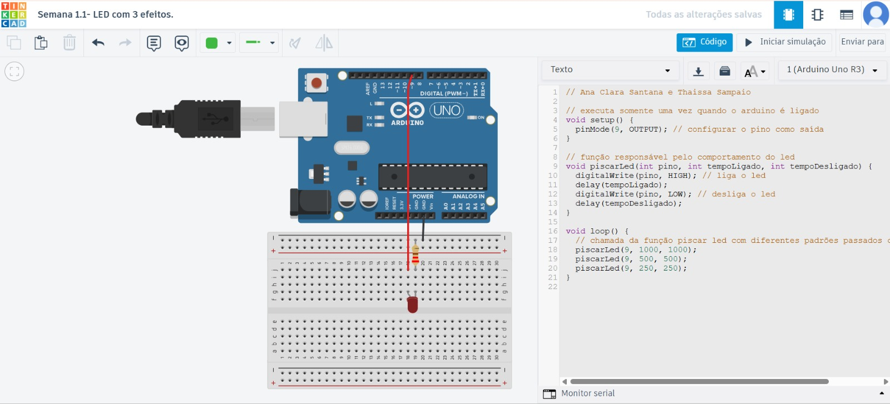

# Semana 1.1 — Introdução ao Arduino, GitHub e simulação  

## 1. Objetivo da semana 
O objetivo dessa semana foi aprender como o hardware e o software se comunicam usando o Arduino. A gente configurou pinos digitais de saída para fazer um LED piscar de três formas diferentes, criamos funções no código e usamos o GitHub para realizar os registros.
## 2. O que foi estudado 
 
- Uso e configuração de pinos digitais do Arduino. 
- Entendemos como funcionam o LED e o resistor de limitação de corrente. 
- Estrutura básica de um programa Arduino setup() e loop().
- Simulação no Tinkercad. 
- Registro da atividade no GitHub.
  
## 3. O que eu aprendi 

### Estudante 1 
Aprendi como estruturar o código do Arduino, também entendi a importância de usar resistores para não queimar o LED .

### Estudante 2 
Texto individual do estudante. 
 
## 4. Explicação técnica da atividade 
O software define o comportamento dos pinos físicos do hardware. Quando o código manda acender o LED, o processador muda a tensão no pino correspondente, configurar um pino como OUTPUT faz o microcontrolador controlar componentes externos, como o LED, a função setup() executa uma vez, no início, para as configurações iniciais já a função loop() executa mais de uma vez.
## 5. Circuito 
 

## 6. Componentes utilizados 

| Componente | Modelo / Valor | Quantidade | Função no Circuito |
| :--- | :--- | :--- | :--- |
| **Arduino Uno** | R3 | 1 | Executar o código de programação e fornecer a tensão necessária para alternar os padrões de pisca do LED. |
| **LED** | Vermelho (ou cor padrão) | 1 | Sinalizar visualmente as três sequências de teste programadas (lento, rápido e personalizado) |
| **Resistor** | $220\ \Omega$ | 1 | Limitar a corrente elétrica para proteger o LED de sobrecarga quando a porta digital for acionada. |
| **Protoboard** | 400 pontos | 1 | Servir como base física para conectar eletricamente o LED e o resistor de forma rápida e segura. |
| **Fios (Jumpers)** | Macho-Macho | 2 |Realizar a ligação da porta digital escolhida para o resistor/LED e fechar o circuito retornando ao pino GND. |

## 7. Código 
Indicar o arquivo principal do firmware e explicar a lógica usada. 

## 8. Testes realizados 
Os testes foram feitos no Tinkercad. A gente colocou o código com a função piscarLed, clicou em "Iniciar Simulação" e observou o LED para ver se ele seguia os três tempos propostos: lento, rápido e personalizado.
## 9. Resultados obtidos 

O circuito respondeu exatamente como a gente esperava. O LED execultou os tempos definidos na função, alternando entre o pisca lento, o pisca rápido e a pulsação personalizada, e depois recomeçou o ciclo.

https://github.com/user-attachments/assets/6d4a25db-227e-438c-a5c7-17cebac246bc

## 10. Problemas encontrados 
O LED não estava em série com o resistor, que ocasionava ele não responder aos comandos.
## 11. Correções realizadas 
O LED foi reposicionado em série com o resistor, logo ele funcionou como era esperado.
## 12. Relação com aplicações do dia a dia 
Algo similar acontece na aviação, helicópteros utilizam um controlador para gerenciar as luzes externas obrigatórias, permitindo que pilotos enxerguem helicópteros à noite.
## 13. Critério de aceite 
Ele passou nos critérios definidos, a entrega atende todos os requisitos: o LED faz os três padrões pedidos (lento, rápido e personalizado), e a gente adaptou o código usando uma função com parâmetros, que era obrigatório.
## 14. Link da simulação, vídeo ou evidência 
Link da simulação no tinkercad: https://www.tinkercad.com/things/lckZMCQX1at-semana-11-led-com-3-efeitos/editel?returnTo=https%3A%2F%2Fwww.tinkercad.com%2Fdashboard&sharecode=RTjBNf2qVtlleUC3pr_FZLy9RC8K6l82iDFtoU6p9ZI
